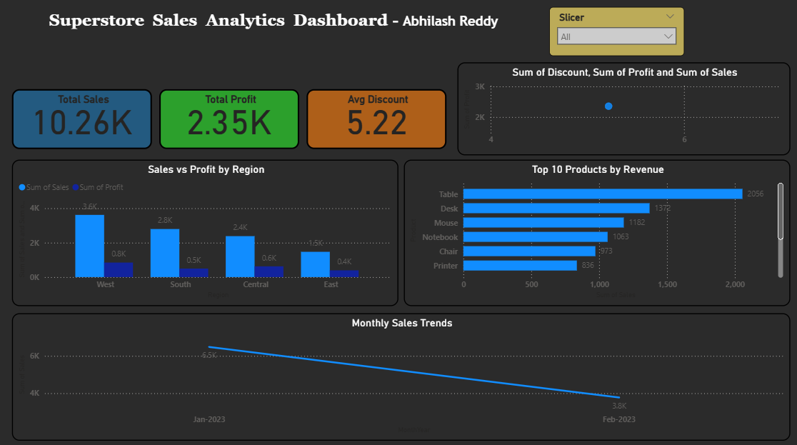

# PowerBI-Retail-Sales-Dashboard
Retail Sales Performance Dashboard built in Power BI analyzing Sales, Profit, Discounts, and Top Products.
# Retail Sales Performance Dashboard (Power BI)

## 📌 Project Overview
This Power BI dashboard analyzes **Retail Superstore Sales** data to provide insights into revenue, profit, discounts, and top-performing products.

## 📊 Key Insights
- Total Sales, Total Profit, and Average Discount KPIs
- Sales vs Profit analysis by Region
- Monthly Sales Trend with Profit comparison
- Top 10 Products by Revenue
- Discount vs Profitability (Scatter Analysis)

## 🛠 Tools Used
- Power BI (Data Visualization)
- Excel (Dataset)

## 📷 Dashboard Preview

## 📁 Files in this Repository
- `Retail_Sales_Dashboard.pbix` → Power BI Dashboard
- `Retail_Superstore_Dataset.xlsx` → Dataset
- `README.md` → Project Documentation

---
⭐ If you like this project, consider giving it a star!
